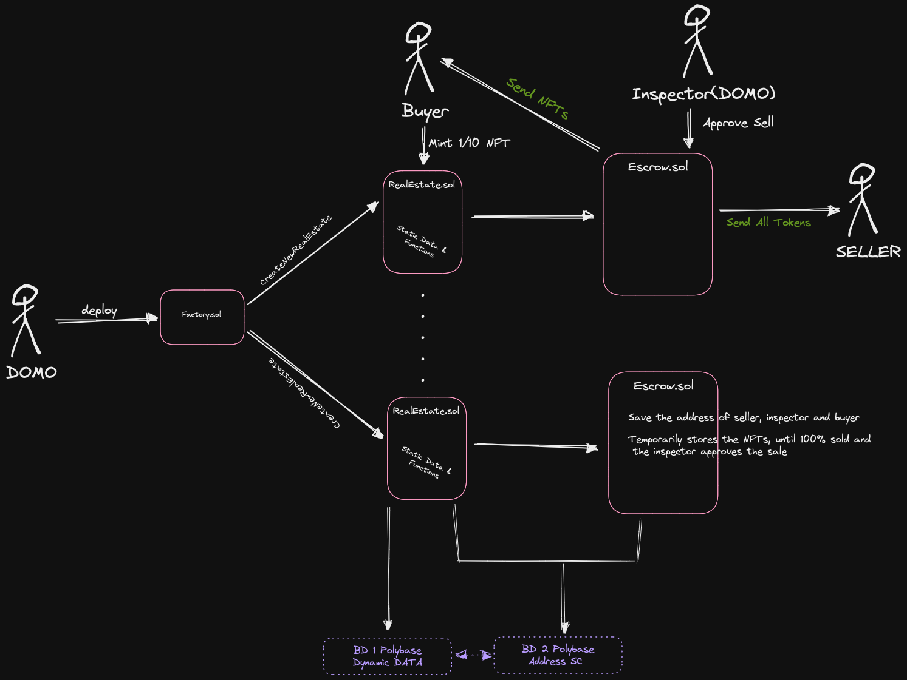
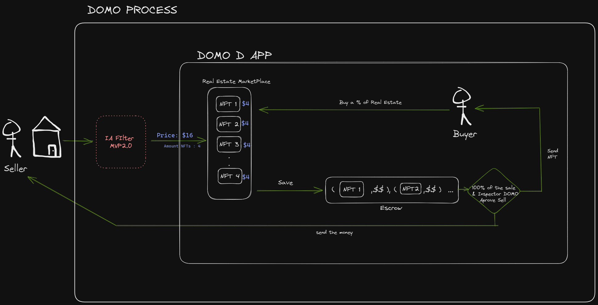

<p align="center">
    <br>
    
    <br>
<p>

<p>

**INVEST IN REAL ESTATE FRACTIONS** <br>
<br>
**No more long processes. Relax and receive monthly income - DOMO takes care of everything!** 
<br>
<br>
<p>


## DApp

Just enter into https://domo-app.vercel.app/ and enjoy !! 

### Sections 

- *Home:* You can see All Real Estate in sell into the DOMO
- *My Home:* You see yours NFTs 
- *Instructions:* Don't know how to start? Read this!!
- *Market Place:* Stay Stun !! 


## Smart Contracts Deployed
| ¿What? | Link |
|---|---|
| Factory SC | 0x36db9F8383a73bEE62e3e10D121a7dC6a4Ac5A54  |
| Real Estate 1 | 0x4B77d0D8743453c4F626AB14e9513316F76DD76C |
| Escrow 1 | 0x5F6365f4aF0194bd0c65486802aE10c63A0771Bd |
| Real Estate 2 | 0x04bb5CA925D2Bc8405286cb349B4A85595dc21e2 |
| Escrow 2 | 0x495ecAA89AEDB59d493D047761B6D7740E94EF7D |
|  Real Estate 3 | 0xB8016AD7E4aBB6E4dc0f2162265C6257Dcd01fFf |
| Escrow 3 | 0xE8b3C3fdeD68D359B857b5899E8920c57938Ef1C |

Segundo Batch 
 
| ¿What? | Link |
|---|---|
| Factory SC | 0xF42e36F81106f029f7d3BF013F7cA5Cd755857d6  |
| Real Estate 1 | 0xE734151C1dff574c9A57Bd58e92DeAEb5E1D677b |
| Escrow 1 |  |
| Real Estate 2 |  |
| Escrow 2 |  |
|  Real Estate 3 |  |
| Escrow 3 |  |

## How Works ? 
### Tech Flow 
<p align="center">
    <br>
    
    <br>
<p>

### User Flow
<p align="center">
    <br>
    
    <br>
<p>

## Others Links 
[Eth Scaling App ](https://ethglobal.com/showcase/domo-5kv83)  
[escalidraw ](https://excalidraw.com/#room=eed41750993fbf3d5acd,WK2xKC5PZBkeo6M0nGj9fw)
[Pitch ](https://ethglobal.com/showcase/domo-5kv83)  

## Next Steps 
### Blockchain Tech 
- [ ] Improve Smart Contracts 
- [ ] Pay with FIAT
- [ ] Expand Polybase
    - [ ] Smart Contracts With FIAT pay
    - [ ] User Data 
    - [ ] BD for Pre Image for the buyer users 
- [ ] Biconomy tech and Multicall 

### IA Tech 
- [ ] Create Real Estate Image with IA
- [ ] Create a model for filtering good properties

### Others 
- [ ] App Responsive 
- [ ] Improve Styles 
- [ ] Sell a real House 


## Getting Started

First, run the development server:

```bash
npm run dev
# or
yarn dev
# or
pnpm dev
```

### Hardhat 
```bash
npx hardhat compile
npx hardhat test
npx hardhat node
npx hardhat run scripts/deploy.js --network localhost
npx hardhat run scripts/deploy.js --network mumbai

```

## Install dependencies 

### General 
```bash
 yarn install
```

 ### Hardhat 
```bash
 yarn add --dev hardhat
```

 ### Open Zeppelin
```bash
 yarn add @openzeppelin/contracts
 yarn add ipfs-http-client 
```
### Tailwind
```bash
 yarn add -D tailwindcss@latest postcss@latest autoprefixer@latest
 npx tailwindcss init -p
```
### Others 
```bash
 yarn add axios
 yarn add alchemy-sdk
 yarn add dotenv
 yarn add react-scroll
 yarn add web3modal
 yarn add @polybase/client
 yarn add @polybase/auth

 yarn add react-hook-form
 yarn add framer-motion
```  
 <!-- yarn add web3modal  -->
## Tutorials 
1) [Account Abstraction ](https://www.youtube.com/watch?v=qBPoVs66CxE&ab_channel=NaderDabit)
2) [Build Full Stack Polygon](https://www.youtube.com/watch?v=GKJBEEXUha0)
3) [Metadata Standars](https://docs.opensea.io/docs/metadata-standards)
4) [How to deploy Polygon SC](https://docs.alchemy.com/docs/how-to-code-and-deploy-a-polygon-smart-contract)

5) [QuickNode](https://www.quicknode.com/guides/ethereum-development/smart-contracts/how-to-create-a-smart-contract-factory-in-solidity-using-hardhat/) 

6) [Smart Contract Factory](https://medium.com/coinmonks/smart-contract-factories-how-to-create-a-contract-to-create-another-contract-248a120f331a#:~:text=A%20Contract%20Factory%20is%20a,of%20the%20newly%20deployed%20contract.) 
7) [Chai Testing](https://www.chaijs.com/api/bdd/) 
8) [Suarmi Pay in FIAT](https://app.swaggerhub.com/apis/CUENTAS_1/suarmi_api/1.1.0#/info) 
9) [SC Molde](https://github.com/The-Stripes-NFT/the-stripes-nft-contract/blob/main/TheStripesNFT.sol ) 
10) [Post Online](https://reqbin.com/) 
11) [Time in SC](https://betterprogramming.pub/solidity-tutorial-all-about-time-units-b392324bea32) 
12) https://github.com/magiclabs/example-nextjs
13) https://github.com/hedgehold/prode-front 
14) https://docs.replit.com/tutorials/web3/escrow-contract-with-solidity 
15) https://medium.com/@shuffledex/eventos-en-la-blockchain-c%C3%B3mo-emitirlos-con-solidity-y-recepcionarlos-con-web3-js-6411dafee8b7

IPFS 
https://docs.infura.io/infura/networks/ipfs/how-to/make-requests
https://github.com/ipfs/js-ipfs/tree/master/packages/ipfs-http-client#url-source
https://community.infura.io/t/how-to-upload-multiple-files-on-ipfs-under-the-same-cid-with-curl/5202/3

ABI 
https://blog.chain.link/what-are-abi-and-bytecode-in-solidity/
https://docs.ethers.org/v5/api/contract/contract-factory/
https://ethereum.stackexchange.com/questions/139213/differences-between-ethers-getcontractfactory-new-ethers-contract-and-ne


### TO DO 
https://www.youtube.com/watch?v=c_-b_isI4vg
https://ethereum.stackexchange.com/questions/146974/how-to-start-with-erc-4337
https://docs.alchemy.com/docs/solidity-payable-functions 

Magic Link


https://magic.link/docs/home/welcome
https://magic.link/docs/connect/getting-started/quickstart
https://magic.link/docs/connect/wallet-api-reference/javascript-client-sdk
https://magic.link/docs/connect/wallet-api-reference/javascript-client-sdk#showui()
https://codesandbox.io/s/github/magiclabs/magic-demo-react-web3?file=/src/libs/magic.ts


